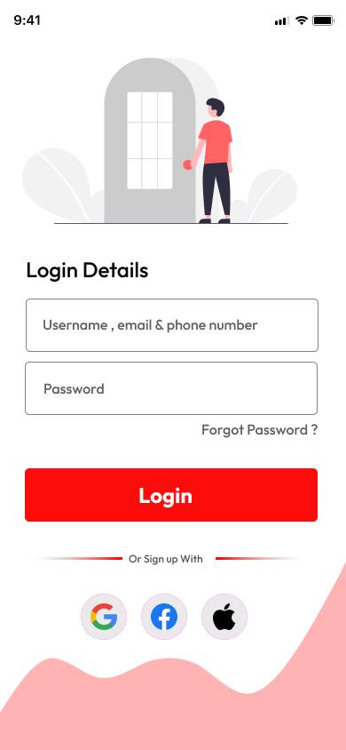
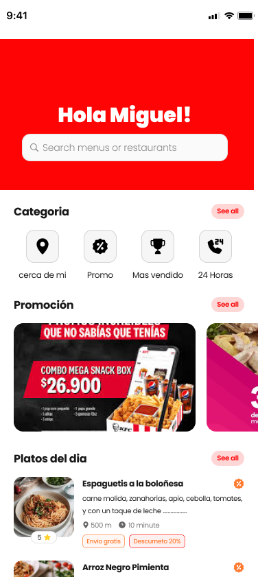
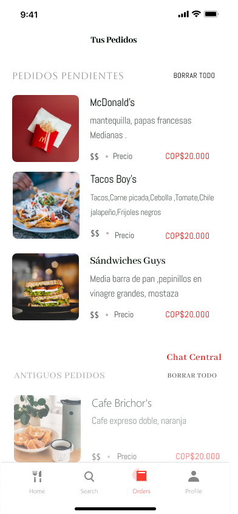
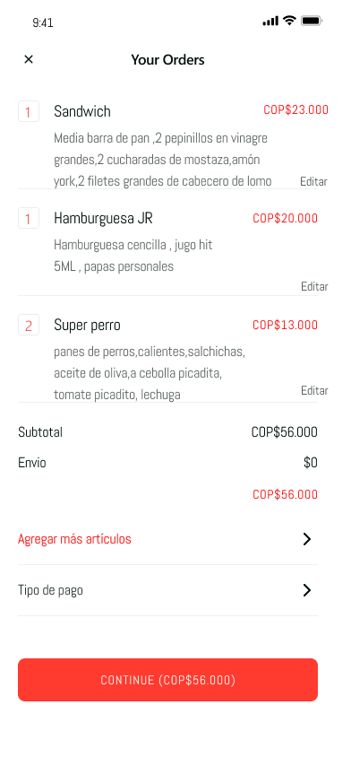
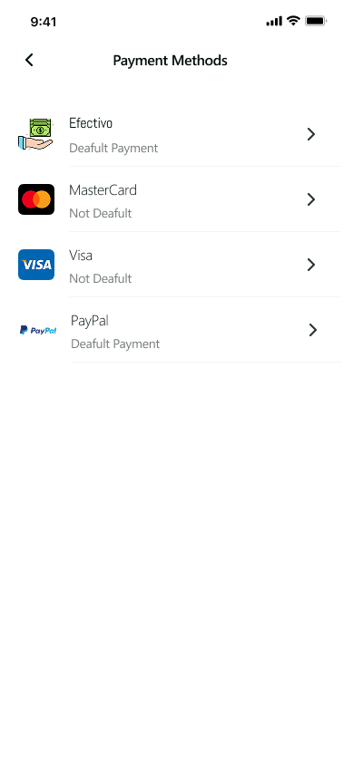
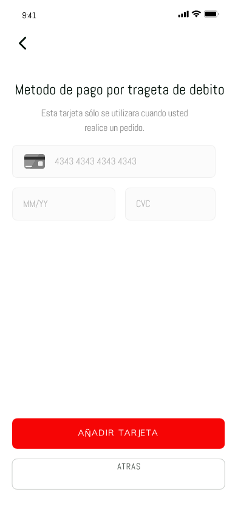
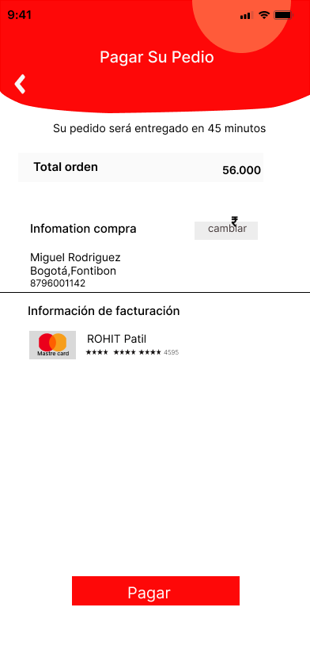
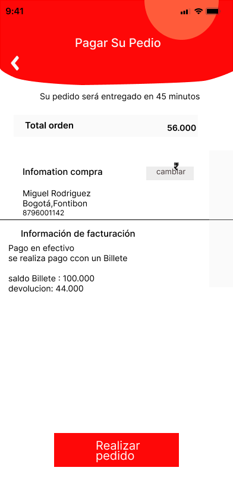
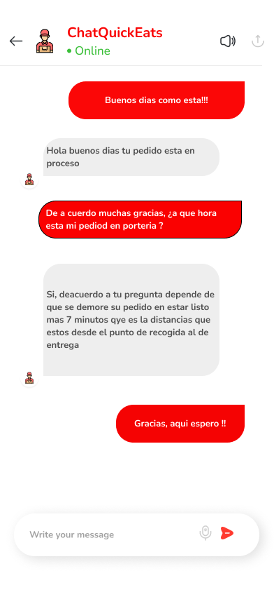
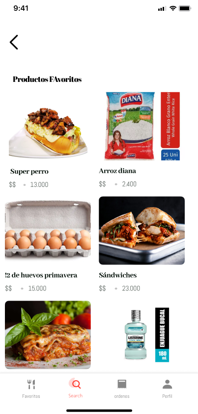

# Diseño de interfaz de usuario

La aplicación tendrá la siguientes pantallas

1. Pantalla 1: Login, registro del usuario a la aplicacion QuickEats.

2. Pantalla 2: Inicio, interfas de inicio de la aplicacion QuickEats.

 
 
3. Pantalla 3: Buscar comida, se hace busca la comida o producto consultado.

 
   
4. Pantalla 4:Categoria, se realiza un filtro ubicando ciertos productos en categorias especificas.

 
   
5. Pantalla 5: Historial, se realiza un listado con los pedidos ya finalizados y los que estan en curso.

 
   
6. Pantalla 6:Factura, esta vista se encarga de mostrar los productos a comprar auntes de realizar el pedido.

 
    
7. Pantalla 7:Opciones de pago, se muestra las opciones de pago que teiene el usuario para pagar su pedido.

 

8.  Pantalla 8:Metodo de pago credito, se muestra los requisitos para la targeta se credito.
 

9. Pantalla 9:Metodo de pago debito, se muestra los requisitos para la targeta se debito.

10. Pantalla 10:Pago targeta, Se muetra la confirmacion de la targeta y su pedido.

11. Pantalla 11:Pago Efectivo, Se muetra la confirmacion del metodo de pago,sus datos y su pedido.

 
12. Pantalla 12:Chat, se realiza un chat para que el usuario interactue en tiempo real con el repartidor.

13. pantalla 13:Favoritos, se realiza una vista donde el usuario pueda ver los productos que escogio como favoritos.

# Referencias

- [Material Design: Foundations](https://m3.material.io/foundations)
- [Material Design: Style](https://m3.material.io/styles)
